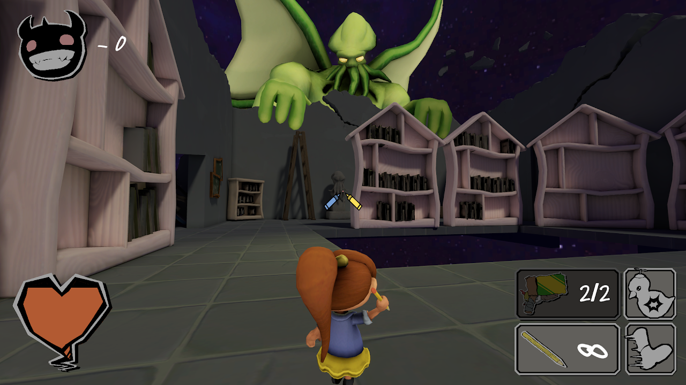

 

# About This Game

Cthulhu & Me is a 3D third-person roguelike boomer-shooter where, on a bright sunny day, Cthulhu rises from the ocean to terrorize the world once again, but notices and takes interest in a little girl who is seemingly not afraid of this eldritch being. 

Play as this little girl in the world of dreams, her dreams. Battle monstrosities and terrors created by Cthulhu as you navigate through a maze of randomized
rooms while collecting a variety of imaginary weapons such as the legendary crayon shotgun.

  <iframe 
    src="https://itch.io/embed/3496510?bg_color=2F5AAD&fg_color=F7FF00&link_color=038F34" 
    frameborder="0" 
    style="position: absolute; top: 0; left: 0; width: 100%; height: 165px;">
  </iframe>

            

# Project Details

*Roles:* Systems & Tools Programmer, Repo Master

*Team Size:* 12

*Duration:* January 2025 - April 2025

*Technology:* Unity, C#

* Built using Scrum and Agile methodologies

 

# Level Manager

Created a level manager tool in order to help my designers created the randomized room layouts that they wanted while making it as modular as possible.

* Learned how to use the Editor class
* Learned how to serialize Unity scenes when making an editor tool

